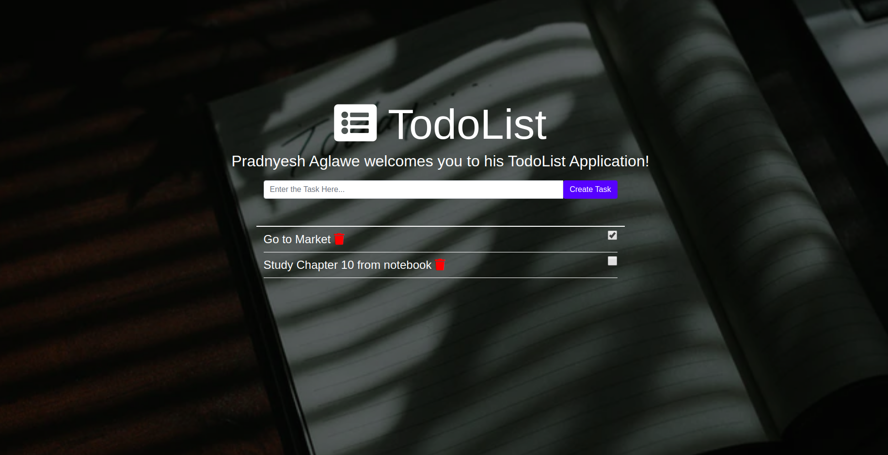

# Todo-List-Web-Application

A Todo List WebApp with Node.js, Express.js and MongoDB
 

# Screenshot

 
To run this project in your local computer follow the following steps: 

1. Install Node.js and npm.
2. Install nodemon using command $ npm install -g nodemon
3. Clone the project and open the terminal with project directory.
4. Run command $ npm i , to install node modules
5. Run command $ npm start, this will start the server at localhost:8000
6. Open browser and type localhost:8000
